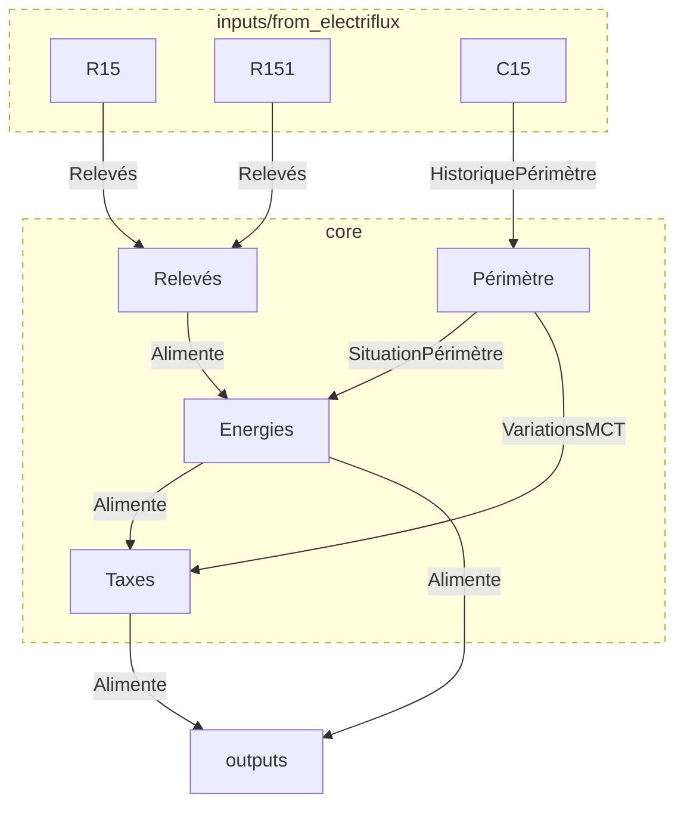

# ⚡ ElectriCore - Moteur de calculs métier pour les données énergétiques

**ElectriCore** est un module dédié au traitement et à l'analyse des données issues du réseau électrique. Il constitue la **brique métier principale** pour les outils de supervision et de gestion énergétique, tels que **LibreWatt**, **un module Odoo**, et d'autres interfaces exploitant les données d'Enedis.

## 📌 Fonctionnalités principales

✅ **Transformation des données brutes** en formats exploitables\
✅ **Calcul des indicateurs métier** (rendement, consommation, anomalies…)\
✅ **Gestion multi-sources** pour agréger les données de différentes origines\
✅ **Export des résultats** vers divers outils (Odoo, LibreWatt, bases de données…)\
✅ **Haute testabilité** pour garantir la fiabilité des calculs

---

## 🚀 Sources de données supportées

ElectriCore est conçu pour fonctionner avec différentes sources de données, notamment :

- 🌡️ **ElectriFlux** : Données extraites des fichiers XML Enedis
- 🔗 **API SOAP Enedis** ( à venir )

---

## 🤦‍♂️ Architecture

ElectriCore est structuré en plusieurs modules indépendants :

📺 **electricore/**\
├── `core/` → Fonctions métier (calculs, agrégation de données…)\
├── `inputs/` → Connecteurs pour récupérer les données (`from_electriflux.py`, `from_soap.py`…)\
├── `outputs/` → Interfaces pour stocker/exporter (`to_odoo.py`, `to_postgres.py`…)\
├── `tests/` → Suite de tests unitaires et validation des algorithmes


---

## 📊 Utilisation

### Exemple d’appel à **ElectriCore** pour transformer des données :

```python
from electricore.core import process_data

# Chargement des données brutes
data = [...]  # Données en provenance d'ElectriFlux ou de l'API Enedis

# Traitement par ElectriCore
result = process_data(data)

# Résultat des calculs métier
print(result)
```

---

## 🔍 Tests et validation

ElectriCore est conçu pour être **hautement testable**. Avant toute modification, lancez les tests unitaires :

```bash
pytest tests/
```

TODO : Mettre en place un pipeline CI/CD est en place pour garantir la stabilité du projet et éviter les régressions.

---
## 🏗️ Roadmap

✔️ Implémentation du moteur de calculs métier\
✔️ Intégration avec ElectriFlux\
⏳ CI/CD\
⏳ Utiliser pandera https://pandera.readthedocs.io/en/stable/ pour valider les dataframes. 
⏳ Ajout d’un connecteur vers l’API SOAP Enedis\
⏳ Stockage des résultats en base de données\
⏳ Documentation API détaillée


