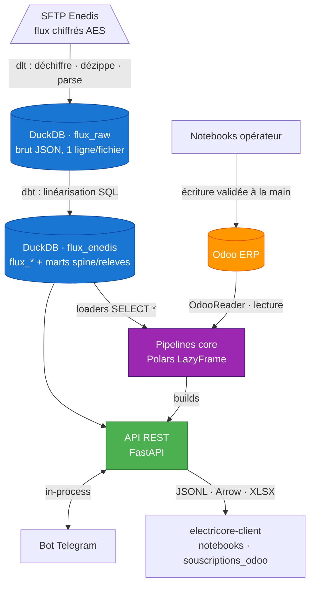

# Développer

Architecture, patterns établis et exemples de code pour qui code en amont du
projet. Contenu déménagé depuis le README (voir [ADR-0054](../adr/0054-chemin-documentation-roles-escalier.md)) :
le README n'en garde qu'un renvoi.

## Architecture



Deux principes structurants :

- **L'API est le hub.** Bot, notebooks, intégrations et clients externes passent tous par l'API
  REST ; DuckDB, les pipelines `core/` et les adaptateurs ERP sont des composants internes
  ([ADR-0009](../adr/0009-architecture-api-centrique.md)). L'API est en **lecture seule** vis-à-vis
  d'Odoo : toute écriture est appliquée à la main par un opérateur, depuis un notebook
  ([ADR-0012](../adr/0012-api-read-only-odoo.md)).
- **`core/` est strictement ERP-agnostique.** Il ne dépend que de Polars/DuckDB/Pandera/stdlib —
  garanti par un test de pureté CI. Tout adaptateur ERP vit dans `integrations/`
  ([ADR-0016](../adr/0016-core-erp-agnostique.md)).

### Les modules en un coup d'œil

| Module | Rôle | Doc |
|--------|------|-----|
| 📥 **`ingestion/`** | ELT dlt + dbt : SFTP Enedis → DuckDB (déchiffrement AES, landing brut, linéarisation SQL) | [README](https://github.com/Energie-De-Nantes/electricore/blob/main/electricore/ingestion/README.md) · [docs/ingestion.md](../ingestion.md) |
| 🧮 **`core/`** | Calculs énergétiques en Polars pur (`loaders` · `pipelines` · `builds` · `models`), ERP-agnostique | [CONTEXT.md](https://github.com/Energie-De-Nantes/electricore/blob/main/electricore/core/CONTEXT.md) |
| 🔌 **`integrations/odoo/`** | Adaptateur Odoo : `OdooReader` / `OdooQuery` / `OdooWriter` | [Query Builder Odoo](../odoo-query-builder.md) |
| 🌐 **`api/`** | API REST FastAPI : flux, relevés, taxes, facturation, chronologie, ingestion | [README](https://github.com/Energie-De-Nantes/electricore/blob/main/electricore/api/README.md) |
| 🤖 **`bot/`** | Bot Telegram : UI opérationnelle, client de l'API (zéro logique métier) | [README](https://github.com/Energie-De-Nantes/electricore/blob/main/electricore/bot/README.md) |
| ⚙️ **`config/`** | Registre runtime pydantic-settings + règles tarifaires CSV (TURPE, accise, CTA) | [ADR-0024](../adr/0024-trois-registres-de-savoir.md)/[0025](../adr/0025-registre-runtime-pydantic-settings.md) |
| 📦 **`packages/electricore-client/`** | **Client léger distribué séparément** (PyPI) : httpx + pydantic, flux JSONL typé | [README](https://github.com/Energie-De-Nantes/electricore/blob/main/packages/electricore-client/README.md) · [ADR-0043](../adr/0043-electricore-client-paquet-separe.md) |

> `electricore/operator_launcher.py` (commande `electricore-notebooks`) est un **pont
> transitoire** vers les notebooks opérateur (voir plus bas). Le dossier `electricore/client/`
> est un résidu vide : le vrai client est `packages/electricore-client/`.

## Installer pour développer

- Python 3.12+ et [uv](https://docs.astral.sh/uv/getting-started/installation/)

```bash
git clone https://github.com/Energie-De-Nantes/electricore.git
cd electricore

uv sync                                   # runtime : core + API + bot
uv sync --extra ingestion --extra dbt     # + ingestion SFTP (dlt + dbt)
uv sync --extra viz                        # + libs notebooks (marimo, altair, plotly)
uv sync --extra ingestion --extra dbt --extra viz   # dev local complet
```

### 1. Ingérer les flux Enedis → DuckDB

```bash
uv run --extra ingestion --extra dbt python -m electricore.ingestion test   # smoke : 2 fichiers/flux
uv run --extra ingestion --extra dbt python -m electricore.ingestion r151    # un flux
uv run --extra ingestion --extra dbt python -m electricore.ingestion all     # production : tous les flux
uv run --extra ingestion --extra dbt python -m electricore.ingestion rebuild # dbt seul (zéro réseau, ~13 s)
```

Résultat : la base `electricore/ingestion/flux_enedis_pipeline.duckdb` (schéma `flux_raw` pour le
brut, `flux_enedis` pour les tables linéarisées et les marts). Voir [docs/ingestion.md](../ingestion.md).

### 2. Calculer une facturation mensuelle (core)

```python
from electricore.core.builds.contexte_mensuel import contexte_du_mois

# Compose : spine/chronologie (dbt) → historique → abonnements + énergie → facturation
ctx = contexte_du_mois("2026-05-01")   # None → dernier mois disponible

ctx.facturation_mensuelle   # méta-périodes mensuelles agrégées (validé Pandera)
ctx.abonnements             # périodes d'abonnement + TURPE fixe
ctx.energie                 # périodes d'énergie par cadran + TURPE variable
ctx.releves_utilises        # relevés tracés = relevés utilisés (traçabilité d'index, ADR-0038)
ctx.historique_enrichi      # substrat d'événements filtré sur l'horizon
```

Les loaders DuckDB sont des **query builders fluides immuables**
([ADR-0007](../adr/0007-query-builders.md)) qui poussent les filtres dans le `WHERE` :

```python
from electricore.core.loaders import c15, r151, releves, spine, chronologie

historique = c15().filter({"Date_Evenement": ">= '2024-01-01'"}).limit(100).collect()
tous_releves = releves().filter({"prm": ["PDL123"]}).collect()   # mart canonique (ADR-0029)
```

> Fonctions disponibles : `c15()`, `r151()`, `r15()`, `f15()`, `r64()` (flux Enedis bruts) et
> `releves()`, `spine()`, `chronologie()`, `affaires()` (marts transverses).

### 3. Consommer l'API

```bash
uv run uvicorn electricore.api.main:app --reload
curl http://localhost:8000/health
curl -H "X-API-Key: <votre_cle>" "http://localhost:8000/releves?prm=12345678901234&limit=10"
open http://localhost:8000/docs   # Swagger interactif
```

Depuis un consommateur externe, le **client léger** typé (paquet PyPI distinct) évite de tirer
polars/duckdb/fastapi :

```bash
pip install electricore-client            # base : httpx + pydantic
pip install "electricore-client[arrow]"   # + client Arrow (DataFrames polars)
```

```python
from electricore_client import ElectricoreClient

client = ElectricoreClient(url="https://electricore.example", api_key="…")

# Méta-périodes : flux JSONL typé, sans enveloppe ni pagination
with client.meta_periodes(mois="2026-05-01", rsc=["RSC1"]) as flux:
    for periode in flux:        # PeriodeMeta (releves_utilises imbriqués, source_hash)
        ...

# Chronologie facturiste : faits + verdicts, sans montant
with client.chronologie(pdl="12345678901234") as flux:
    lignes = flux.collect()
```

### 4. Piloter via le bot Telegram

L'exploitation quotidienne (ingestion, exports, taxes, contrôles pré-facturation) passe par un
bot Telegram ([ADR-0010](../adr/0010-bot-telegram-ui-operationnelle.md)) démarré dans le process
de l'API quand `BOT__TOKEN` est défini. Cinq domaines : `/ingestion`, `/flux`,
`/perimetre`, `/taxes`, `/facturation` (sans argument = clavier découvrable ; avec argument =
action directe). Voir le [README du bot](https://github.com/Energie-De-Nantes/electricore/blob/main/electricore/bot/README.md).

## Modèle de données — la spine assemblée en dbt

Le changement structurant récent ([ADR-0041](../adr/0041-chronologie-contrat-spine-relationnelle-dbt.md),
[ADR-0045](../adr/0045-relations-spine-reference-cle-normalisation-chronologie-releves.md)) tient
en une phrase : **le cœur consomme, dbt assemble**. La *Chronologie du contrat* — la séquence
ordonnée des faits d'une situation contractuelle — n'est plus reconstruite dans des DataFrames
Polars ; c'est une **spine relationnelle assemblée entièrement en dbt**, que le cœur se contente
de **filtrer et découper**.

Trois marts dbt forment le substrat (schéma `flux_enedis`, exposés hors du namespace `/flux`,
[ADR-0032](../adr/0032-modeles-marts-hors-flux-namespace.md)) :

- **`releves`** — la ligne de temps **canonique** des relevés : union arbitrée des sources
  (priorité `C15 > R64 > R151`), dédupliquée par **identité métier** du relevé, harmonisation
  R151 J→J+1 portée ici, `releve_id` = clé courte stable. Source de vérité unique des valeurs
  d'index ([ADR-0028](../adr/0028-identite-releve-cle-metier-priorite-sources.md)/[0029](../adr/0029-modele-releves-canonique-dbt-assemble-coeur-arbitre.md)).
- **`spine_contrat`** — l'épine `(pdl, ref_situation_contractuelle, date, source, type_fait)` :
  événements C15 ∪ grille FACTURATION calendaire (1ᵉʳ de chaque mois), avec les **attributs de
  situation forward-fillés en SQL** (FTA, puissance, niveau d'ouverture…).
- **`chronologie_releves`** — la projection énergie de la spine : bornes FACTURATION appariées
  aux relevés périodiques au **grain jour** (equi-join, l'ancien `join_asof` ±4 h a disparu du cœur).

Les marts sont **indépendants de l'horizon** ; l'horizon n'est qu'un **filtre** posé au boundary du
cœur, ce qui préserve la pureté (deux runs à horizon fixe découpent identiquement). Une seule
spine, **N frises** : le substrat est partagé, mais les découpages **abonnement** et **énergie**
restent séparés ([ADR-0023](../adr/0023-periodisations-separees-abonnement-energie.md)) — ils se
croisent, ils ne s'imbriquent pas.

### Vocabulaire essentiel

- **PDL** : point de livraison physique (14 chiffres, un Linky). **RSC** : situation contractuelle
  d'un PDL — c'est le **grain de facturation** (un PDL qui change de RSC en cours de mois porte deux
  méta-périodes). **FTA** : formule tarifaire d'acheminement (sélectionne la grille TURPE et le
  nombre de cadrans).
- **Chronologie du contrat (RSC)** vs **Chronologie du point (PDL)** vs **Chronologie des relevés**
  (projection énergie). Chaque périodisation est `filtre(spine) ⨝ relation`.
- **Cadrans** (convention `grandeur_cadran_unité`) : `base` ; `hp`/`hc` ; `hph`/`hch`/`hpb`/`hcb`
  (4 quadrants saison × heures). Index en kWh **entiers** (floor au boundary dbt,
  [ADR-0034](../adr/0034-index-kwh-entiers-floor-au-boundary-dbt.md)).
- **TURPE fixe** (part puissance) vs **variable** (part énergie). **Accise** (TICFE) et **CTA**
  (taxe sur le TURPE fixe). Règle d'intégration : electricore livre le **montant €** quand il
  possède l'assiette, le **taux** sinon ([ADR-0027](../adr/0027-endpoint-lecture-meta-periodes-odoo-tire.md)).
- **Qualité de période** (`réelle`/`estimée`/`incalculable`, [ADR-0033](../adr/0033-qualite-periode-remplace-data-complete-coverage.md))
  et **statut de communication** (`communicante`/`non_communicante`, [ADR-0036](../adr/0036-statut-communication-routage-energie-grain-meta.md)) :
  l'effet et la cause, deux axes jumeaux remplaçant les anciens `data_complete`/`coverage`.

Détails : [docs/contrat-meta-periodes.md](../contrat-meta-periodes.md),
[docs/conventions-dates-enedis.md](../conventions-dates-enedis.md),
[docs/qualite-donnees-r151.md](../qualite-donnees-r151.md), et le glossaire
[`electricore/core/CONTEXT.md`](https://github.com/Energie-De-Nantes/electricore/blob/main/electricore/core/CONTEXT.md).

## API REST

Authentification par en-tête **`X-API-Key`** (endpoints publics : `/`, `/health`, `/docs`,
`/redoc`, `/openapi.json`). Pendant une ingestion, les routes de lecture renvoient `503` le temps
que le writer DuckDB relâche le verrou.

| Route | Rôle |
|-------|------|
| `GET /health`, `GET /` | Statut, fraîcheur de la base, tables disponibles (public) |
| `GET /flux/{table}` · `/info` · `.xlsx` · `.arrow` | Flux Enedis bruts (JSON paginé, Arrow, XLSX) |
| `GET /releves` · `/info` · `.xlsx` · `.arrow` | Mart canonique des relevés (ADR-0029) |
| `GET /perimetre/affaires` | Cockpit des affaires SGE ouvertes (X12/X13) |
| `POST /ingestion/run` · `GET /ingestion/jobs` · `/jobs/{id}` | Déclencher et suivre les jobs d'ingestion |
| `GET /taxes/millesimes` · `/peremption` | Millésimes et péremption des taux régulés (sans ERP) |
| `GET /taxes/accise/*` · `/cta/*` | Rapports & détails Accise / CTA (XLSX, Arrow) — *requiert Odoo* |
| **`GET /facturation/meta-periodes`** | Méta-périodes mensuelles en **flux JSONL typé** |
| **`GET /facturation/chronologie`** | Frise facturiste d'un `pdl` ou `rsc` (faits + verdicts, **sans montant**) |
| **`POST /facturation/turpe-variable`** | Calculateur TURPE variable (RPC typé, l'appelant fournit l'assiette) |
| `GET /facturation/rapport.xlsx` · `documents.xlsx` · `check/odoo` | Rapports & contrôles pré-facturation — *requiert Odoo* |
| `GET /admin/api-keys` | Configuration des clés API |

Les routes **JSONL** (`meta-periodes`, `chronologie`) répondent une ligne JSON par objet, **sans
enveloppe ni pagination** ; les métadonnées (version de contrat, mois, grain) voyagent en en-têtes
HTTP. Chaque ligne est validée en construisant le modèle pydantic — impossible d'émettre une ligne
hors contrat. Les routes marquées *requiert Odoo* renvoient `501` et sont masquées du bot sur une
instance sans ERP. Détails : [README de l'API](https://github.com/Energie-De-Nantes/electricore/blob/main/electricore/api/README.md).

## Notebooks (édition dev)

Les notebooks [Marimo](https://github.com/Energie-De-Nantes/electricore/tree/main/notebooks)
(réactifs, Polars, [ADR-0002](../adr/0002-polars-uniquement.md)) s'éditent en dev :

```bash
uv run marimo edit notebooks/   # édition complète (pipelines, validations TURPE, exploration Odoo)
```

Le runbook de l'**opérateur non-dev** (lanceur `electricore-notebooks`, notebooks lecture seule
publiés sur PyPI) est documenté côté opérateur : [docs/operateur-notebook.md](../operateur-notebook.md).

## Développement & tests

```bash
# Setup dev recommandé
uv sync --extra ingestion --extra dbt --group test --group typecheck

uv run --group test pytest              # suite complète (~30 s)
uv run --group test pytest -n auto      # exécution parallèle (pytest-xdist)
uv run --group test pytest -m unit      # markers : unit/integration/slow/smoke/duckdb/odoo/hypothesis
uv run --group test pytest --cov=electricore   # couverture (plancher CI : 45 %)

uvx ruff check --fix ; uvx ruff format  # lint + format
uv run --group typecheck mypy           # typage (surface publique core/)
uvx pre-commit install                  # hooks ruff/gitleaks (+ --hook-type pre-push pour pytest)
```

Près de **800 fonctions de test** réparties sur 119 fichiers, sans secret requis (les tests
dépendant d'Odoo s'auto-skippent). Couverture : fixtures + snapshots Syrupy (gros du filet),
tests d'expressions Polars, contrats Pandera, et property-based Hypothesis ; **golden d'ingestion**
générés depuis les XSD Enedis (parité dbt garantie en CI) ; **tests d'architecture** verrouillant
la pureté ERP du cœur ([ADR-0016](../adr/0016-core-erp-agnostique.md)) et les imports par rôle
([ADR-0019](../adr/0019-roles-loaders-pipelines-builds-integrations.md)).

**CI** (GitHub Actions) : lint + typecheck + tests (matrice Python 3.12/3.13), plus un job
`test-client` qui prouve en venv isolé que `electricore-client` ne tire ni polars ni duckdb ni
fastapi. Les **releases** publient l'image `ghcr.io/energie-de-nantes/electricore` (sur tag `v*`,
build → scan secrets → smoke → push) et le client sur PyPI via OIDC (sur tag `client-v*`, versionné
indépendamment).

**Contribution** : `main` est protégé. Brancher → commit (Conventional Commits en français) →
pousser → ouvrir une PR → la CI tourne → **le merge est une étape humaine** sur le site. Détails :
[CONTRIBUTING.md](https://github.com/Energie-De-Nantes/electricore/blob/main/CONTRIBUTING.md).
Nouvel arrivant (profil Rust/Java) : [docs/transmission.md](../transmission.md).

## Feuille de route

Ce qui précède décrit la **réalité livrée** sur `main`. Les directions en cours :

- **Protection des secrets au repos** — follow-ups de la bascule secrets-as-code
  ([ADR-0044](../adr/0044-secrets-as-code-sops-age.md), déjà mergée pour le mécanisme) : chiffrement
  disque (LUKS + Tang/NBDE), isolation `raw.db`/`serve.db`, durcissement DuckDB de l'API, et OpenBao
  quand la flotte le justifiera.
- **`souscriptions_odoo`** — addon qui consommera l'API via `electricore-client` et **remplacera**
  le lanceur de notebooks opérateur transitoire.
- **Régularisation des contrats lissés** — recalcul a posteriori des contrats facturés au lissé
  ([#191](https://github.com/Energie-De-Nantes/electricore/issues/191)).
- **Estimation des périodes non-communicantes via R15**
  ([#322](https://github.com/Energie-De-Nantes/electricore/issues/322)).
- **Nouvelles sources** — API SOAP Enedis (alternative SFTP), courbes Axpo, autres fournisseurs.

Le suivi se fait en [issues GitHub](https://github.com/Energie-De-Nantes/electricore/issues) et en
[décisions d'architecture](../adr/0001-monorepo.md).

## Pour aller plus loin

[Carte des domaines](carte-domaines.md) · [charte de la documentation](charte-documentation.md) ·
[guide de déploiement](https://github.com/Energie-De-Nantes/electricore/blob/main/docs/deploiement.md) ·
[configuration complète](https://github.com/Energie-De-Nantes/electricore/blob/main/docs/configuration.md).

[Retour à l'accueil](../index.md).
