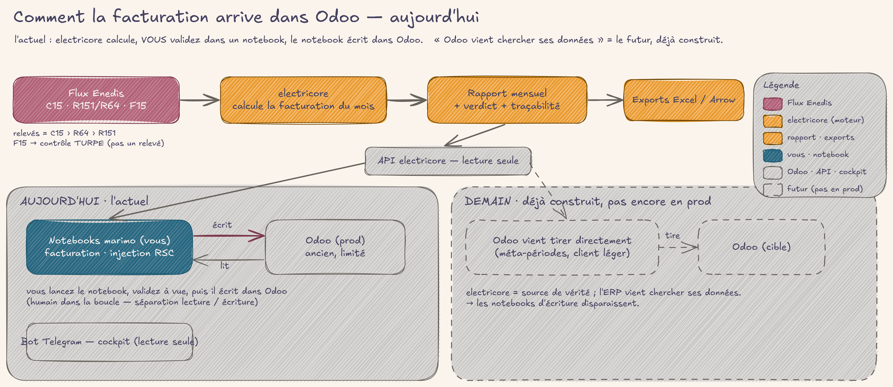
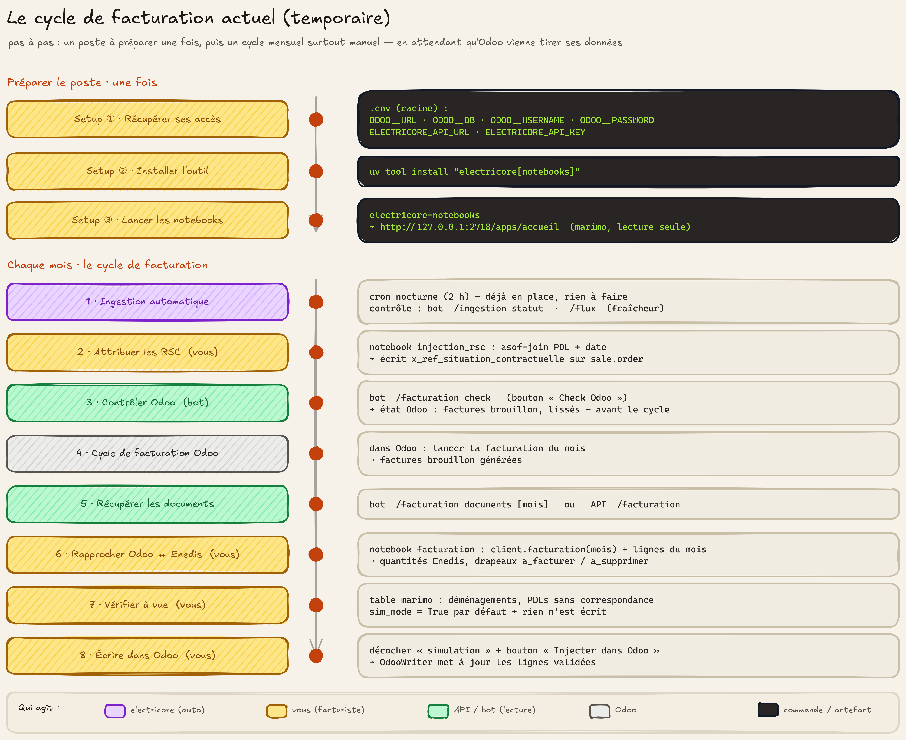
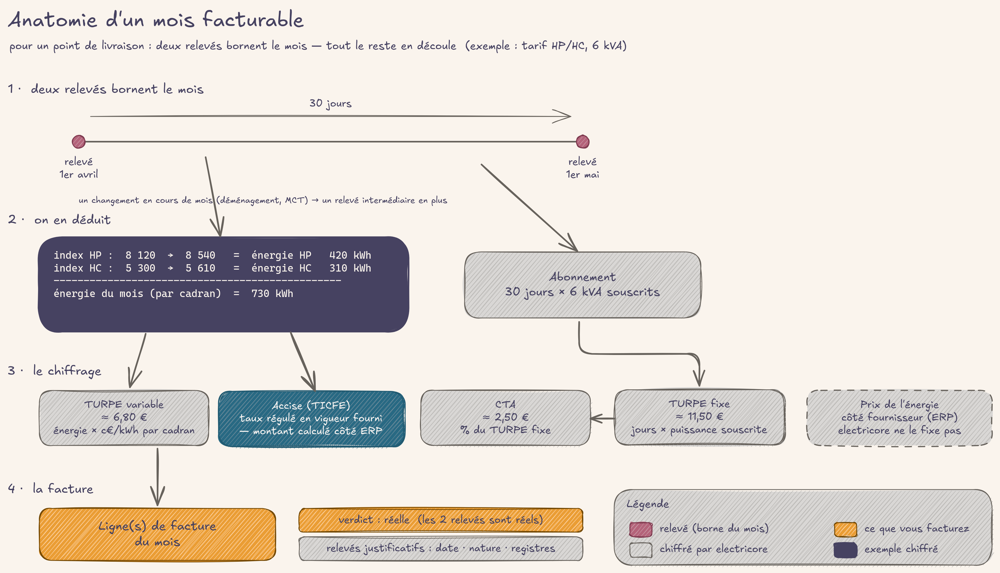
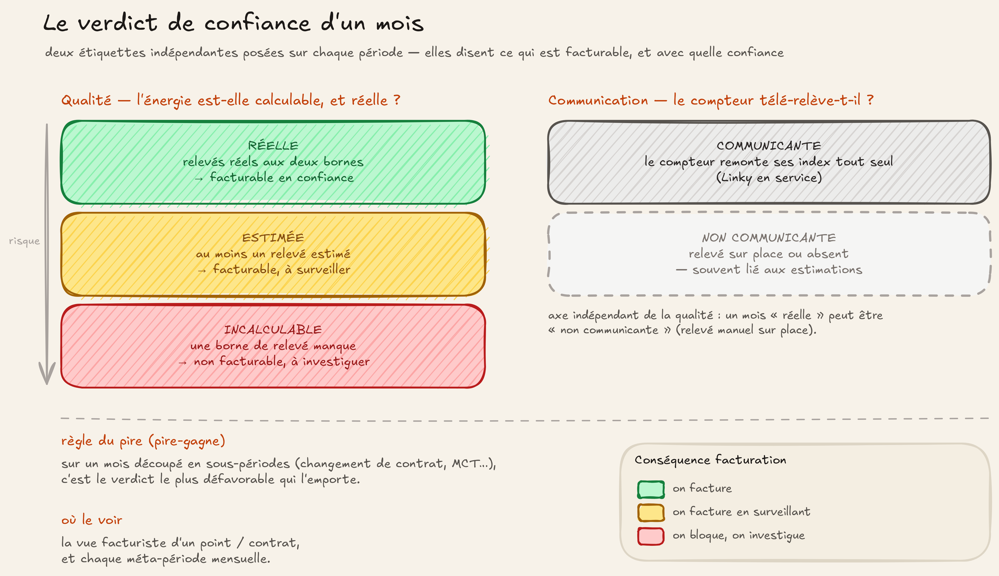

# Ce qui a changé pour le facturiste (juin 2026)

> Lecture côté métier du [CHANGELOG technique](https://github.com/Energie-De-Nantes/electricore/blob/main/CHANGELOG.md), de la première
> release versionnée **v1.3.5** (1ᵉʳ juin 2026) à la ligne stable **3.4** (29 juin 2026).
> On y parle de ce que la machine **calcule et livre pour vous** — pas de comment c'est codé.
>
> **Deux états à ne pas confondre :**
> - **L'actuel** (ce document, principalement) : electricore calcule la facturation et
>   l'expose **en lecture**. Aujourd'hui, c'est **vous** qui écrivez dans Odoo, via des
>   **notebooks marimo** que vous validez à vue. L'Odoo de production est ancien et ne sait
>   pas (encore) venir chercher ses données tout seul.
> - **Le futur** (section « Ce qui se prépare », plus bas) : electricore devient la source de
>   vérité et **Odoo vient tirer ses données** directement. C'est **déjà construit**, mais ce
>   n'est pas encore le chemin de production.

---

## Où on en est aujourd'hui (l'actuel)

electricore prend les flux bruts d'Enedis, les ingère **chaque nuit**, et en calcule une
**proposition de facturation mensuelle vérifiable** : énergie par cadran, abonnement au
prorata, TURPE (réseau) et taxes, chaque mois étiqueté d'un **verdict de confiance** et
**rattaché aux relevés** qui le justifient. Tout ça est exposé **en lecture seule** par
l'API.

**Comment ça arrive dans Odoo aujourd'hui :** vous lancez un **notebook marimo**
(`facturation`, `injection RSC`), il lit la facturation calculée + les lignes Odoo, vous
**validez à vue**, puis le notebook **écrit dans Odoo**. Cette séparation lecture/écriture
(toute écriture passe par un humain) est un choix assumé : une erreur de facturation coûte
cher, donc aucun automate ne pousse de modification sans contrôle. Le **bot Telegram** est
votre cockpit (état de l'ingestion, contrôles, exports) — en **lecture seule**, il n'écrit
jamais dans Odoo.

### Le cycle de facturation, pas à pas

Concrètement, voici le déroulé actuel — un poste à préparer **une fois**, puis un cycle
**chaque mois** qui reste largement manuel (c'est temporaire, le temps qu'Odoo sache tirer
ses données). À gauche, les étapes dans l'ordre ; à droite, la commande ou l'artefact concret.

**Préparer le poste (une fois) :** récupérez vos accès dans un fichier `.env` (connexion
Odoo `ODOO__*` + `ELECTRICORE_API_URL` / `ELECTRICORE_API_KEY`), installez l'outil opérateur
(`uv tool install "electricore[notebooks]"`), puis lancez `electricore-notebooks` — il sert
les notebooks marimo en **lecture seule** sur `http://127.0.0.1:2718/apps/accueil`.

**Le filet de sécurité :** chaque notebook qui écrit dans Odoo (`injection_rsc`,
`facturation`) garde une **double garde** — mode *simulation* coché par défaut, et écriture
réelle bloquée derrière le bouton « Injecter dans Odoo ». Rien ne part dans Odoo tant que
vous n'avez pas regardé puis cliqué.

---

## Comment se fabrique un mois

À l'intérieur d'un mois, pour un point de livraison, la mécanique est toujours la même :
deux relevés bornent le mois, l'énergie par cadran et les jours d'abonnement en découlent,
le TURPE et les taxes s'empilent. Les événements exceptionnels comme un changement de compteur sont pris en compte automatiquement, en divisant le mois en périodes calculables.

Et chaque mois (ou sous-période) reçoit un **verdict de confiance** qui dit s'il est
facturable, et avec quelle assurance.

---

## La grande affaire du mois : des calculs justes

Avant juin, plusieurs chiffres étaient **silencieusement faux** — pas en erreur, juste
faux. Le gros du travail de juin a été de les rendre **exacts et démontrables**.

> **Aucune fausse facture émise.** Ces versions (v2.0, v3.0) **n'ont jamais été le chemin
> de facturation en production** : pendant toute cette période, la facturation réelle
> passait par l'**ancien système**. Les chiffres « silencieusement faux » vivaient dans
> electricore **en construction**, jamais sur les factures de vos clients. Ce qui suit
> décrit les défauts qu'on a corrigés *avant* de faire d'electricore une source de
> facturation fiable.

- **Les index étaient ~1000× trop grands** *(v3.0)*. Les relevés périodiques (R151/R64)
  arrivent d'Enedis en **wattheures** ; ils étaient mélangés aux index C15 déjà en kWh.
  Résultat : énergie, TURPE variable, accise **et** facturation corrompus. Désormais tout
  est ramené en **kWh entiers** dès l'entrée, à toutes les couches. **C'est la correction
  la plus importante de la période.**
- **Cinq défauts d'ingestion latents corrigés d'un coup** *(v2.0)*, révélés en
  re-construisant l'historique complet :
  - relevés agrégés par point (des « chimères » mélangeant plusieurs événements),
  - **~75 % des index R15** qui mélangeaient index et consommation,
  - relevés multiples **perdus** (jusqu'à 20 par point sur R151),
  - re-livraisons F15 **comptées deux fois** (261 lignes),
  - choix **arbitraire** du gagnant quand R64 livrait plusieurs fenêtres.
  Le grain devient **le relevé** : un relevé = une ligne, plus de mélange.
- **Accise sur mois net-négatif** *(v3.0)* : un avoir ou une régularisation peut rendre un
  mois négatif ; ce n'est plus rejeté (la déclaration accise est trimestrielle et nette).
- **Niveau de service périmé sur un changement sans relevé** *(v3.3)* : un mois pouvait
  être marqué « non communicant » à tort parce qu'un changement de niveau (sans index)
  n'était pas pris en compte. Le mois retrouve son vrai statut.

> **Pour vous :** les montants que vous facturez depuis la ligne 3.0 sont justes là où ils
> étaient discrètement faux. Si vous comparez à un historique d'avant juin, attendez-vous à
> des écarts — c'est l'ancien qui avait tort.

---

## Les nouvelles capacités, dans l'ordre d'arrivée

### v1.4 — Le moteur tourne tout seul *(2 juin)*
Déploiement serveur : ingestion Enedis **chaque nuit à 2 h**, API et bot Telegram
disponibles 24/7, sauvegardes quotidiennes de la base.
> **Pour vous :** vous arrêtez de lancer les traitements à la main. Les données du jour sont
> là le matin.

### v1.5 → v1.6 — La facturation devient un livrable *(4–5 juin)*
- **Rapprochement Odoo ↔ Enedis** : les lignes de facture sont confrontées à la facturation
  calculée par electricore (énergie HP/HC/Base, abonnements).
- **Le notebook lit l'API, vous validez, le notebook écrit** : le principe « electricore en
  lecture, écriture Odoo via notebook humain » se met en place — c'est encore le mode de
  fonctionnement actuel.
- **Toutes les lignes du mois, avec drapeaux** *(v1.6)* : `à facturer` / `à supprimer`. On
  peut enfin **tester et auditer hors période de facturation**, et voir d'un coup d'œil ce
  qui reste à émettre ou à nettoyer.
- **Premiers exports structurés** (format Arrow) de la facturation, de l'accise et de la CTA.
> **Pour vous :** un rapprochement chiffré contre Odoo, et la possibilité de
> préparer/contrôler un mois même hors fenêtre d'émission.

### v1.7 — Tout passe par l'API, et les exports se rangent *(7 juin)*
- **Exports rapport + détail** pour l'accise, la CTA et la facturation, au format **Excel
  (.xlsx)** et Arrow, avec une convention d'URL homogène (`…/rapport.xlsx`, `…/detail.xlsx`).
- Le **rapport** (proposition métier, agrégée) et le **détail** (lignes brutes, pour l'audit)
  sont désormais deux livrables distincts.
- Les notebooks ne se connectent plus en direct à Odoo pour les données : ils **consomment
  l'API HTTP**.
> **Pour vous :** des téléchargements Excel homogènes, et une séparation nette entre la
> proposition à facturer et le détail d'audit.

### v2.0 — Ingestion fiable *(11 juin)*
Refonte du chemin d'ingestion (voir « calculs justes » ci-dessus) : c'est la release qui a
remis les chiffres d'aplomb. Nouveau geste de **reconstruction sans réseau** : re-calculer
toutes les tables depuis le brut en quelques secondes après un ajustement de règle.
> **Pour vous :** le filet de tests compare désormais chaque table à une référence, donc une
> régression de calcul se voit avant d'atteindre la prod.

### v2.1 — Le bot Telegram devient un cockpit *(11 juin)*
- **5 domaines métier** au lieu de 11 commandes à plat : `/etl` (renommé `/ingestion` en
  v3.0), `/flux`, `/perimetre`, `/taxes`, `/facturation`. Sans argument → menu à boutons ;
  avec arguments → raccourci.
- **Alertes proactives** : un 🚨 tombe dès qu'un job d'ingestion échoue, **y compris le job
  nocturne automatique**.
- **Fraîcheur des données** : `/flux` affiche la dernière date *métier* par table.
- **Check pré-facturation Odoo** accessible depuis le bot.
> **Pour vous :** un cockpit quotidien. Vous savez si les données sont fraîches, et vous
> êtes prévenu si l'ingestion casse — sans aller regarder.

### v3.0 — Le grand stable : confiance et traçabilité *(18 juin)*
La release de fond. Au-delà des corrections de calcul :

- **Une ligne de temps unique des relevés.** Toutes les sources (R151, R64, relevés
  contractuels C15) fusionnées en une seule chronologie arbitrée, base de tout le reste.
- **Cette ligne de temps est elle-même téléchargeable** : un export dédié des relevés
  (Excel / Arrow, filtrable par PDL, par source, par période) — une surface d'audit en
  libre-service, au-delà de la traçabilité par mois.
- **Traçabilité des index jusqu'à la facture.** Chaque méta-période porte la **liste des
  relevés** qui la bornent (date, nature réel/estimé, registres réels du compteur) — pour
  qu'Odoo les stocke et les affiche (exigence légale + espace usager).
- **Verdicts de confiance.** Chaque mois reçoit deux étiquettes : **qualité** (`réelle` /
  `estimée` / `incalculable`) et **communication** (`communicante` / `non communicante`).
  Elles remplacent les anciens drapeaux flous et disent en un mot si un mois est facturable
  et avec quelle confiance.
- **Cockpit des affaires SGE** (demandes de prestation X12/X13) : suivi en lecture seule des
  demandes en cours, avec leur ancienneté.
- **Taux régulés datés.** Accise (TICFE) et CTA sont versionnés par millésime ; le bon taux
  à la date est dérivé automatiquement, et une **alerte Telegram** prévient quand un taux est
  probablement périmé. Un formulaire ouvre la mise à jour aux non-techniciens.

> **Pour vous :** des données de facturation fiables, traçables et conformes. Le verdict de
> qualité vous dit quoi facturer ; la traçabilité justifie chaque index sur la facture ;
> l'alerte de taux vous évite de facturer une taxe périmée.

### v3.1 → v3.3 — Le flux ne s'arrête plus, la trace se renforce *(19–20 juin)*
- **Trousseau de clés Enedis.** Enedis a basculé son chiffrement (AES-128 → AES-256) début
  juin, ce qui avait **bloqué l'ingestion**. Le moteur gère maintenant un trousseau de
  plusieurs clés et trouve la bonne tout seul — et un échec de déchiffrement n'est **plus
  silencieux** (le job passe en échec → alerte bot).
- **Trace d'index légale enrichie** : les **7 registres canoniques** (base/HP/HC et les 4
  quadrants saisonniers) ressortent, limités à ceux réellement présents sur le compteur.
> **Pour vous :** les données continuent d'arriver malgré les changements côté Enedis, et si
> quelque chose se déchiffre mal, vous le savez. Les relevés affichables sur la facture sont
> au bon niveau de détail.

### v3.4 — Vue facturiste, provision des lissés *(29 juin)*
- **Vue facturiste d'un point ou d'un contrat** : la **frise complète** d'un PDL/contrat —
  tous les faits (changements de contrat, relevés) tissés avec les verdicts (qualité,
  communication) de chaque période, **sans montant tarifaire**. De quoi comprendre l'histoire
  d'un point d'un coup d'œil.
- **Estimation de provision des contrats lissés** *(amorce)* : pour un contrat lissé démarrant
  sans historique, electricore estime la **provision d'énergie** (en kWh) à partir du profil
  sur 12 mois glissants. Disponible **dès aujourd'hui** via la commande bot `/provision`.
  **En kWh uniquement** (le prix reste au fournisseur), **en amont de la régularisation**.
> **Pour vous :** vous voyez toute l'histoire d'un point sans ouvrir dix écrans, et vous
> obtenez une provision de départ raisonnable pour un nouveau contrat lissé.

---

## Ce qui se prépare (le futur — déjà construit, pas encore en prod)

Tout ceci **existe** dans electricore, mais ne sera le chemin de production que lorsque
l'Odoo cible saura tirer ses données. **Le jour où ce sera branché, les notebooks d'écriture
disparaîtront.**

- **electricore source de vérité, Odoo vient tirer.** Au lieu que vous poussiez depuis un
  notebook, Odoo construira ses périodes en lisant le flux **méta-périodes** d'electricore,
  et lui demandera ses **montants de TURPE variable** au coup par coup (Odoo envoie
  l'assiette, electricore renvoie le montant €).
- **Résolution de contrat** : retrouver la situation contractuelle (RSC) à partir de
  l'identifiant d'affaire Enedis — le chaînon pour relier une demande à son contrat côté ERP.
- **Client léger + flux en continu** : un petit paquet (`electricore-client`) et des flux
  ligne-à-ligne permettront à Odoo (et au futur module `souscriptions_odoo`) de consommer
  electricore sans embarquer tout le moteur.

### En préparation — v3.5 (release candidate, non stable) : les gros contrats *(30 juin)*
Ingestion du flux **C12** (contrats C2–C4, puissance > 36 kVA) : prérequis pour traiter la
facturation et les catégories d'accise des **gros sites**. Encore en *release candidate*,
pas dans la ligne stable.

---

## Confort au quotidien (QOL), en bref

- **Ingestion automatique nocturne** + sauvegardes quotidiennes *(v1.4)*.
- **Alertes proactives** sur échec d'ingestion, y compris le job nocturne *(v2.1)*.
- **Fraîcheur des données** visible par table dans le bot *(v2.1)*.
- **Bot par domaines** avec menus à boutons et raccourcis *(v2.1)*.
- **Exports Excel/Arrow** homogènes (rapport + détail) pour facturation, accise, CTA
  *(v1.5–v1.7)*, plus l'export des relevés *(v3.0)*.
- **Test/audit hors période** de facturation grâce aux drapeaux `à facturer`/`à supprimer`
  *(v1.6)*.
- **Alerte de taux régulé périmé** sur Telegram *(v3.0)*.
- **Messages d'erreur d'ingestion lisibles** (la vraie cause, plus un code nu) *(v3.0)*.
- **Démarrage qui échoue clairement** si une clé/un secret manque, au lieu de planter plus
  tard *(v3.0)*.

---

## Qualité des calculs, récapitulatif

| Quoi | Effet sur la facture | Depuis |
|---|---|---|
| Index Wh → kWh entiers | Énergie, TURPE variable, accise, total **justes** (étaient ~1000× trop grands) | v3.0 |
| Grain = le relevé (fin des chimères, index/conso démêlés, doublons F15) | Consommations et montants **fidèles** au compteur | v2.0 |
| Arbitrage déterministe des sources de relevés (C15 > R64 > R151) | Plus de relevé « gagnant » au hasard | v2.0 / v3.0 |
| Harmonisation des dates de relevés (R151 décalé d'un jour) | Bornes de mois **cohérentes** entre sources | (baseline) v1.0, consolidé v3.x |
| Accise : mois net-négatif accepté | Avoirs/régularisations ne bloquent plus l'export | v3.0 |
| Niveau de service au bon mois (changement sans relevé) | Plus de faux « non communicant » | v3.3 |
| Verdict qualité `réelle`/`estimée`/`incalculable` | On sait **quoi facturer** et avec quelle confiance | v3.0 |

---

*Détails techniques, ruptures de contrat d'API et numéros d'issue : voir le
[CHANGELOG complet](https://github.com/Energie-De-Nantes/electricore/blob/main/CHANGELOG.md).*
