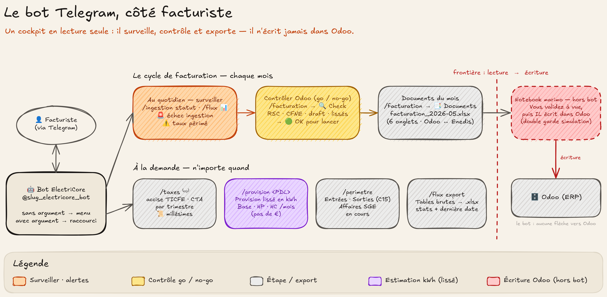

# Guide du bot Telegram (facturiste)

> Le bot Telegram est votre **cockpit** ElectriCore : surveiller l'ingestion, contrôler
> avant de facturer, télécharger des rapports, estimer une provision — depuis votre
> téléphone ou votre poste.
>
> **À retenir d'emblée :** le bot est **en lecture seule**. Il **n'écrit jamais dans
> Odoo**. L'écriture dans Odoo (injection des lignes, RSC) reste le travail des
> **notebooks marimo** que vous validez à la main (voir
> [Ce qui a changé pour le facturiste](changelog-facturiste.md)). Le bot sert à
> **savoir** et à **contrôler**, pas à pousser.



---

## Accéder au bot

Chaque instance a **son** bot, nommé `@<slug>_electricore_bot` (ex.
`@edn_electricore_bot`). Cherchez-le dans Telegram, ouvrez la conversation, tapez
`/start`.

- L'accès est **sur liste blanche** : seuls les comptes Telegram autorisés répondent.
  Un compte non autorisé reçoit `⛔ Accès refusé`. Pour être ajouté, demandez à
  l'administrateur de l'instance (votre identifiant numérique Telegram).
- `/start` (ou `/help`) annonce **l'instance servie** et liste les commandes
  réellement disponibles.

---

## Comment on s'en sert

Six **domaines** métier, chacun utilisable de deux façons :

- **Sans argument → un menu à boutons s'ouvre.** Zéro syntaxe à retenir, tout se
  clique. C'est le mode normal.
- **Avec arguments → action directe** (raccourci pour les habitués) :
  `/taxes accise 2025-T1` fait la même chose que cliquer Accise → 2025-T1.

Trois comportements à connaître :

- **Suivi par édition.** Quand une action est longue (une ingestion, un calcul), le
  bot **édite le même message** : `⏳ en cours` devient `✅ terminé` ou `❌ échec` +
  la cause. Pas de pluie de messages.
- **Les rapports arrivent en pièces jointes.** Les exports partent en **fichiers
  `.xlsx`** dans le chat, prêts à ouvrir dans Excel / LibreOffice.
- **Confirmation à deux taps** pour les actions coûteuses (le `resync` d'ingestion) —
  rien de lourd ne part par mégarde.

> Si votre instance n'a **pas d'Odoo** configuré, les domaines `/taxes` et
> `/facturation` sont **masqués** du menu (ils dépendent de l'ERP).

---

## Au quotidien : est-ce que les données sont saines ?

L'ingestion tourne **toute seule chaque nuit**. Vous n'avez normalement rien à
lancer. Deux réflexes le matin :

- **Les alertes vous trouvent.** Si un job d'ingestion **échoue** (y compris le job
  nocturne), un 🚨 tombe automatiquement dans le chat d'alerte. Un taux régulé
  probablement **périmé** déclenche un ⚠️. Pas d'alerte = rien de cassé.
- **Vérifier la fraîcheur** d'une table : `/flux` puis 📊 sur la table → vous voyez le
  nombre de lignes et **la dernière date de donnée métier**. Pratique avant de
  facturer un mois : la donnée du mois est-elle bien arrivée ?

Si quelque chose a cassé, `/ingestion` → **📊 Statut** liste les derniers jobs avec
leur état, ou **▶️ All** / **📡 Flux…** relance l'ingestion (un flux ciblé ou tout).

---

## Le cycle de facturation, et le rôle du bot dedans

Le bot intervient **avant** et **autour** de la campagne, pas pendant l'écriture.

### 1. Contrôler Odoo avant de lancer — `/facturation` → 🔍 Check Odoo

Le pré-vol. Le bot interroge Odoo et vous rend un bilan :

- les `sale.order` **sans RSC** (`x_ref_situation_contractuelle`),
- les `sale.order` **sans date CFNE**,
- la **répartition des `x_invoicing_state`**,
- les **factures encore en brouillon** (draft),
- les **contrats lissés** dont la ligne énergie est restée à `qty=1`.

Chaque anomalie est cliquable (lien direct vers Odoo). Au-delà de 20 cas, le détail
complet part en **`check_odoo.xlsx`** joint. Si tout est propre, vous voyez :
**🟢 OK pour lancer le cycle de facturation**. C'est votre feu vert.

### 2. Récupérer les documents du mois — `/facturation` → 📑 Documents

Choisissez le mois (les 4 derniers mois révolus en boutons, ou « dernier mois
dispo »). Le bot génère un classeur **`facturation_<mois>.xlsx` à 6 onglets** qui
confronte **Odoo ↔ Enedis** (énergie HP/HC/Base, abonnements). C'est votre support de
**vérification à vue** du mois.

> ⚠️ Ce classeur est un **document de contrôle**, pas une injection. L'écriture
> effective dans Odoo se fait ensuite dans le **notebook marimo** `facturation`, avec
> sa double garde (mode simulation par défaut + bouton « Injecter dans Odoo »). Le bot
> ne pousse rien.

### 3. Calculer les taxes — `/taxes` (Accise TICFE / CTA)

`/taxes` → 🧾 **Accise** ou 📊 **CTA** → choisissez le **trimestre** (4 derniers, ou
« Toutes périodes »). Le bot livre le rapport en `.xlsx`. Raccourci :
`/taxes accise 2025-T1`.

📜 **Millésimes** affiche les **taux régulés que cette instance connaît** (valeur,
date de vigueur, référence) — utile pour vérifier qu'un taux n'est pas périmé avant de
déclarer.

---

## Estimer la provision d'un contrat lissé — `/provision <PDL>`

Pour un contrat **lissé** qui démarre **sans historique**, le bot estime la
**provision d'énergie** à partir du profil sur 12 mois glissants :

```
/provision 12345678901234
```

Vous obtenez la provision **mensuelle et annuelle en kWh** par cadran (Base / HP /
HC), la **couverture** disponible (✅ suffisante / ⚠️ insuffisante), la **qualité**
(réelle / estimée) et un **🔔 signal** quand l'estimation est à revérifier.

> **kWh uniquement** — le **prix reste au fournisseur**. C'est une provision de départ
> raisonnable, **en amont** de la régularisation, pas un montant à facturer.
> Pas de mesure R67 sur la fenêtre ⇒ « estimation impossible (repli manuel) ».

---

## Auditer / exporter à la demande

- **`/flux`** — n'importe quelle table brute Enedis : 📊 stats (volume, dernière date)
  ou 📥 export `.xlsx`. Raccourcis : `/flux stats c15`, `/flux export r151`.
- **`/perimetre`** — mouvements du parc (flux C15) :
  - 📥 **Entrées** (PMES, MES, CFNE) et 📤 **Sorties** (RES, CFNS) en `.xlsx` ;
  - 🗂 **Affaires en cours** : les demandes SGE (X12/X13) non soldées, avec leur
    ancienneté en jours — vue texte, lecture seule.

---

## Ce que le bot ne fait **pas**

- Il **n'écrit jamais dans Odoo** (ni facture, ni RSC, ni ligne). Toute écriture passe
  par un notebook marimo que vous validez.
- Il **ne facture pas** : il calcule, contrôle, exporte. La décision et l'émission
  restent humaines.
- Pas de rôles fins : la liste blanche est tout-ou-rien.

---

## Référence rapide

| Commande | Sans argument (menu) | Raccourcis |
|---|---|---|
| `/ingestion` | All · Test · Rebuild · Flux… · Resync · Statut | `/ingestion statut`, `/ingestion r151 c15` |
| `/flux` | tables → 📊 stats / 📥 export | `/flux stats c15`, `/flux export r151` |
| `/perimetre` | Entrées · Sorties · Affaires en cours | `/perimetre entrees`, `/perimetre affaires` |
| `/taxes` ⁽ᵉʳᵖ⁾ | Accise · CTA → trimestre · Millésimes | `/taxes accise 2025-T1`, `/taxes cta` |
| `/facturation` ⁽ᵉʳᵖ⁾ | 📑 Documents · 🔍 Check Odoo | `/facturation documents 2026-05-01`, `/facturation check` |
| `/provision` | — | `/provision 12345678901234` |
| `/start`, `/help` | aide + instance servie | — |

⁽ᵉʳᵖ⁾ masqué quand aucun Odoo n'est configuré.

*Détail de la surface et de l'architecture : [README du bot](../electricore/bot/README.md).
Ce qui a changé côté métier : [changelog facturiste](changelog-facturiste.md).*
