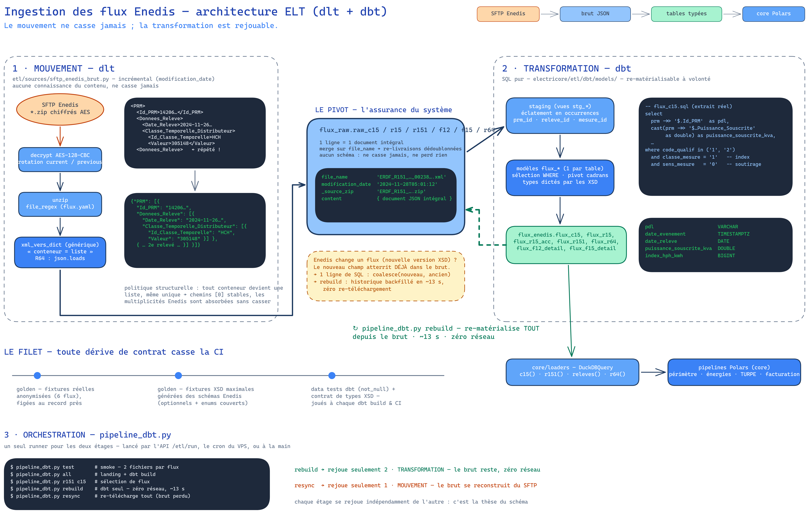

# Ingestion des flux Enedis (ELT dlt + dbt)

> **La thèse en une phrase : le mouvement ne casse jamais ; la transformation est rejouable.**



*(source éditable : [ingestion.excalidraw](ingestion.excalidraw))*

## Vue d'ensemble

L'ingestion est en deux étages strictement séparés, articulés autour d'un pivot : le **brut**.

```
SFTP Enedis ──(dlt : decrypt AES, unzip, incrémental)──▶ flux_raw.raw_*   (documents JSON intégraux)
                                                              │
                                              (dbt : SQL pur, ~13 s) ──▶ flux_enedis.flux_*   (tables typées)
                                                                              │
                                                                  core/loaders (DuckDBQuery) ──▶ pipelines Polars
```

1. **MOUVEMENT — dlt** (`electricore/ingestion/sources/sftp_enedis_brut.py`)
   La chaîne `sftp | decrypt | unzip` ne connaît **rien** du contenu. Chaque fichier extrait est
   converti en dict générique — `xml_vers_dict` pour le XML (politique « **conteneur = liste** » :
   tout élément à enfants devient un tableau, même unique → les chemins `[0]` sont stables et les
   multiplicités Enedis sont absorbées), `json.loads` pour R64 — puis déposé **intégralement** en
   colonne JSON dans `flux_raw.raw_<flux>`. Clé `file_name` en merge : les re-livraisons Enedis
   (même fichier dans plusieurs zips) sont dédoublonnées par construction. L'incrémental dlt
   (`modification_date`) ne porte que sur le mouvement.

2. **TRANSFORMATION — dbt** (`electricore/ingestion/dbt/models/`)
   Un modèle `staging/stg_<flux>` éclate le document en occurrences (clé `prm_id` / `releve_id` /
   `mesure_id` = fichier + position — le **grain** est l'occurrence, jamais le PDL : un PDL revient
   dans N fichiers). Un modèle `flux/flux_<table>` sélectionne (`WHERE`), pivote les cadrans sur le
   **domaine fermé** (`base, hp, hc, hph, hpb, hch, hcb` — contrat de colonnes stable pour les
   loaders) et type selon les **XSD Enedis** (`dateTime`→TIMESTAMPTZ, `date`→DATE, `integer`→BIGINT,
   `decimal`→DOUBLE). Matérialisation dans `flux_enedis.flux_*`, schéma lu par les loaders core.

Le runner de production est `electricore/ingestion/runner.py` (lancé par l'API `/ingestion/run`, cron VPS) :

```bash
uv run python -m electricore.ingestion test      # smoke : 2 fichiers/flux
uv run python -m electricore.ingestion all       # tout (landing + dbt build)
uv run python -m electricore.ingestion r151 c15  # sélection de flux
uv run python -m electricore.ingestion rebuild   # dbt seul — zéro réseau, ~13 s
uv run python -m electricore.ingestion resync    # re-télécharge tout (brut perdu)
uv run python -m electricore.ingestion all --db /tmp/essai.duckdb   # base jetable
```

## Le filet

Trois étages, tous joués en CI (`--extra dbt` installé par le job test) :

| filet | ce qu'il prouve |
|---|---|
| **golden fixtures réelles** (`tests/fixtures/flux/*.xml`, anonymisées) | la linéarisation d'échantillons réels est figée au record près |
| **golden fixtures XSD** (`*_xsd.xml`, générées des schémas Enedis) | les optionnels et les enums que les échantillons réels n'exercent pas |
| **data tests dbt + contrat de types** (`schema.yml`, `test_dbt_flux_golden`) | not_null sur les colonnes critiques, type DuckDB exact dicté par le XSD |

Les golden sont générés **par le chemin de production lui-même** (`generer_golden.py` : landing →
`dbt build` → capture) : tout changement de comportement = diff git des golden, revu en PR.

## Recettes

### Ajouter un champ à un flux

Le champ est **déjà dans le brut** (le landing capture le document intégral). Il suffit de l'exposer :

1. Ajouter la ligne dans le modèle (`ingestion/dbt/models/flux/flux_<table>.sql`) :
   `prm ->> '$.Chemin.Vers.Le.Champ' as mon_champ,` (penser `[0]` pour chaque conteneur traversé) ;
2. `uv run python -m electricore.ingestion rebuild` — **l'historique entier est backfillé**
   (~13 s), zéro re-téléchargement ;
3. Régénérer les golden (`uv run python tests/fixtures/flux/generer_golden.py`), relire le diff,
   committer.

### Le jour où Enedis change un flux (nouvelle version XSD)

**Rien ne casse à l'ingestion** : le brut n'a pas de schéma, les nouveaux documents atterrissent
dès le premier jour. Ensuite, à froid :

1. Récupérer le nouveau XSD (`~/Documents/guides_flux/`) ;
2. **Champ ajouté** → recette ci-dessus. **Champ déplacé/renommé** → le brut contient les deux
   versions mélangées pendant la transition Enedis : `coalesce(nouveau_chemin, ancien_chemin)`
   dans le modèle ;
3. Régénérer la fixture XSD maximale (`uv run python tests/fixtures/flux/generer_fixtures_xsd.py`,
   exige les XSD en local) — elle valide contre le nouveau schéma **par construction** ;
4. `rebuild` + golden + diff en PR.

Garde-fou : un champ critique qui disparaît casse les data tests `not_null` au `dbt build` ;
pour les colonnes non testées, étoffer `schema.yml` au fil de l'eau.

### Ajouter un nouveau flux

1. `flux.yaml` : `file_pattern` (glob SFTP), `format` (xml/json), `file_regex` — c'est tout, le
   mouvement est générique ;
2. `models/sources.yml` : déclarer `raw_<flux>` ;
3. Écrire `staging/stg_<flux>.sql` (éclatement en occurrences) + `flux/flux_<table>.sql`
   (sélection + pivot + types XSD) + entrée `schema.yml` (not_null) ;
4. `MODELES_PAR_RAW` dans `runner.py` ;
5. Fixture anonymisée (`anonymiser.py`) et/ou XSD, golden, spec dans `test_dbt_flux_golden.py`.

### Le flux JSON à la demande R67 (« mesures facturantes »)

Le **R67** n'est pas un flux du quotidien : Enedis le publie **à la demande** (prestation
**M023**, ponctuelle), JSON zippé sur le **même répertoire SFTP que R64**
(`R63_R64_R65_R66_R67_C68/`). Sa raison d'être : **amorcer (cold-start) la provision** d'un
mensualisé dès le premier mois, avant qu'EDN ait accumulé ~12 mois de relevés propres
(brique de [#191](https://github.com/Energie-De-Nantes/electricore/issues/191), sous-tâche
[#214](https://github.com/Energie-De-Nantes/electricore/issues/214)).

**Spécificité — énergie par période, hors `releves`.** Contrairement à un *relevé d'index*
(R64/R151/R15/C15 : un **cumul à un instant**, l'énergie se calcule en différenciant deux
index), R67 porte de l'**énergie de consommation déjà différenciée par le distributeur, sur
une période `[debut, fin)`** et par cadran. C'est un **asset parallèle** : il réutilise la
plomberie JSON de R64 (landing → `stg_r67` → `flux_r67`) mais **n'est jamais unioné** dans
les marts de relevés (`releves`/`chronologie_releves`) — l'y verser ferait calculer une
« énergie d'énergie » et casserait le grain/la priorité des relevés. Modèle figé en
[ADR-0047](adr/0047-flux-r67-energie-par-periode-distributeur-hors-releves.md) ; glossaire
*Mesures facturantes (R67)* dans [`electricore/ingestion/CONTEXT.md`](https://github.com/Energie-De-Nantes/electricore/blob/main/electricore/ingestion/CONTEXT.md).

Le modèle `flux_r67` (wide, 1 ligne par `(pdl, debut, fin)`) : union de tous les
`contexte[]` (les motifs partitionnent le temps sans recouvrement) ; **coalesce d'une
grille par période** (priorité `D/DI000003 ≻ D/DI000001 ≻ F`, repli `F` forcé quand le
distributeur manque — non-Linky — ou est dégénéré) ; pivot `energie_<cadran>_kwh` ; Wh→kWh
par `floor` ; **négatifs préservés** (la régularisation `codeNature=C` est une révision
physique, parfois négative) ; bornes `debut`/`fin` en jour civil `DATE` ; clé propre
`periode_id`. Requêtable via le loader `r67()` (jamais via `releves()`).

**Demander un R67 (procédure portail M023).** L'automatisation de la demande est hors scope
([#216](https://github.com/Energie-De-Nantes/electricore/issues/216) wontfix) — la demande
se fait à la main sur le **portail SGE** :

1. Se connecter au portail SGE (espace fournisseur titulaire) ;
2. Ouvrir une **prestation M023** (« Historique des mesures de consommation facturées ») sur
   le PDL visé — réservé au **fournisseur titulaire actif** ; la profondeur restituée est
   `max(aujourd'hui − 36 mois, dernière mise en service)` ;
3. Le R67 (JSON zippé) est déposé sur le SFTP dans `…/R63_R64_R65_R66_R67_C68/` ;
4. Le pull SFTP de routine le landé (`raw_r67`) ; `flux_r67` se construit au prochain
   `dbt build` (ou `uv run python -m electricore.ingestion rebuild`). Aucune action
   supplémentaire : le glob `*_R67_*.zip` et `MODELES_PAR_RAW` font le reste.

À savoir avant un changement d'échelle : sur un **CFNE** (même foyer, MES ancienne) le R67
remonte *avant* l'entrée chez le fournisseur → sert l'amorçage ; sur un **MES/PMES** (nouvel
occupant) il est coupé à l'entrée → sans valeur (mur occupant RGPD). La voie M023 batch est
recevable **aussi** pour les non-communicants, mais le contenu y est grossier (BASE,
bimestriel, estimé).

### Audit de séquences (complétude des flux)

Le mart `audit_sequences` ([#645](https://github.com/Energie-De-Nantes/electricore/issues/645),
PRD [#644](https://github.com/Energie-De-Nantes/electricore/issues/644)) répond à une seule
question : *a-t-on manqué une archive Enedis ?* Le *numéro de séquence* porté par le nom de
chaque zip est le seul témoin qu'Enedis fournit — glossaire complet (numéro/clé de séquence,
trou, compteur intra-zip) dans
[`electricore/ingestion/CONTEXT.md`](https://github.com/Energie-De-Nantes/electricore/blob/main/electricore/ingestion/CONTEXT.md)
§ Complétude des flux.

**Consultation** — une ligne par anomalie, jamais 0 ligne sur un historique non-vide (la
queue est toujours signalée) :

```sql
select * from flux_enedis.audit_sequences order by flux, type_anomalie;
```

Colonnes : `flux`, `cle_sequence` (nullable), `type_anomalie` (`trou` /
`queue_inverifiable` / `nom_non_reconnu` / `intra_zip_incomplet`), `seq_ou_plage` (numéro,
plage `"00003-00005"`, nom de zip, ou décompte `"<zip> (2/3)"`).

**Où vivent les règles.** Toute la nomenclature (regexp par flux, clé de séquence,
découpage en segments, trous, queue) vit dans **une seule macro**,
`macros/audit_sequences.sql` — brique commune destinée à être réutilisée telle quelle par
le relais de flux ([#646](https://github.com/Energie-De-Nantes/electricore/issues/646), import
dbt package local). Le mart ingestion l'appelle sur l'union des tables brutes du landing, et
y ajoute son propre volet : le **contrôle intra-zip rétrospectif** (chaque zip atterri a-t-il
un XML en base pour chaque rang 1..Y de son compteur `_XXXXX_YYYYY` ?) — spécifique à
l'ingestion (le relais ne dézippe rien en base), donc hors macro.

**Sélection runner.** Comme les marts périodiques (`releves`/`chronologie_releves`),
`construire_dbt()` n'ajoute `+audit_sequences` que si **toutes** ses tables brutes sources
(C15, R15, F12, F15, R151, C12, X12/X13) sont présentes — sinon dbt échoue sur une source
absente (landing partiel, smoke `max_files`).

**Limites à connaître avant d'agir sur une ligne :**

- **R64/R67 hors champ.** Publications ponctuelles (à la demande M023) — leur séquence est
  toujours figée à `00001`, elles ne portent aucune notion de continuité. Ne pas les
  chercher dans la vue, ne pas s'étonner de leur absence.
- **`trou` = « à vérifier », pas certain.** Un trou signale qu'Enedis a annoncé un numéro
  jamais atterri — mais une re-livraison sous un nom de zip *différent* pour le même
  contenu (dédoublonnée par le merge dlt sur `file_name`) peut ponctuellement produire un
  faux positif. Vérifier sur le SFTP / auprès d'Enedis avant d'escalader.
- **`queue_inverifiable` n'est jamais un feu vert.** Le dernier numéro observé d'une clé
  n'est jamais requalifié en « sain » — un trou n'est constatable qu'*entre* deux numéros ;
  le suivant n'est simplement pas encore arrivé.
- **R17 pas encore couvert.** Aucune table `raw_r17` n'existe côté ingestion — pas de zip
  réel à caler contre la macro pour l'instant. Le jour où `sources.yml` la déclarera,
  ajouter sa règle (clé = contrat seul, guide SGE, même forme que C12) au dict `regles`
  de la macro et l'unioner dans `source_union` du mart.
- **Data test `warn`, jamais bloquant.** `aucune_anomalie` (0 ligne attendue) tourne en
  `severity: warn` à chaque `dbt build` — il trace les trous dans la sortie du job sans
  jamais le faire échouer (l'ingestion reste verte sur une base réelle qui a ses trous
  historiques connus).

### Les trois pièges DuckDB (appris sur données réelles, encodés dans les modèles)

1. **Pushdown sous unnest** : un `WHERE` sur un chemin JSON d'un élément unnesté peut être poussé
   sous l'unnest et casté contre le mauvais objet → **extraire en colonnes nommées dans un CTE,
   filtrer dans le suivant** (cf. `flux_c15.sql`).
2. **PIVOT dynamique** : ne crée que les colonnes rencontrées dans le corpus → binder error aval
   sur les absentes → **agrégation conditionnelle sur le domaine fermé des cadrans**.
3. **Cast struct strict** : `CAST(json AS STRUCT(...))` casse sur toute clé inattendue/absente
   (4 formes de `classeTemporelle` observées sur le corpus R64 réel) → **accès JSON tolérant**
   (`->>` / `unnest(cast(... as json[]))`).

## Décisions et histoire

- [ADR-0020](adr/0020-linearisation-en-dbt.md) — la linéarisation vit en dbt (prototype, fork α).
- [ADR-0047](adr/0047-flux-r67-energie-par-periode-distributeur-hors-releves.md) — R67
  (« mesures facturantes ») : énergie par période, asset parallèle, **hors** union `releves`
  (cf. recette « flux JSON à la demande R67 » ci-dessus).
- [ADR-0021](adr/0021-bascule-production-dbt.md) — bascule production actée : parité totale
  legacy/dbt prouvée 3× (golden, 4 400 XML du cache local, corpus SFTP complet ~700 k lignes),
  5 défauts du legacy corrigés en route (grain PDL, index/conso R15 ~75 % faux, chimères
  multi-relevés, double-comptage des re-livraisons F15, gagnant R64 arbitraire).
- Conventions de dates : [conventions-dates-enedis.md](conventions-dates-enedis.md) — R151
  J → J+1 posée au **boundary d'ingestion**, dans le modèle dbt `flux_r151` lui-même
  ([ADR-0042](adr/0042-convention-date-instant-jour-civil-boundary-flux.md), révise
  l'amendement #294 d'[ADR-0003](adr/0003-r151-date-harmonisation.md)) : l'endpoint
  `/flux/r151` sert directement l'instant J+1 harmonisé, plus la date nue ; le mart
  `releves` ne fait que la consommer en passthrough.
